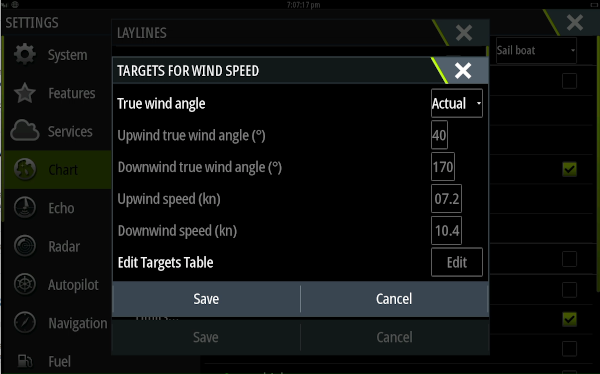
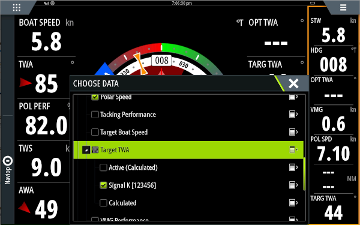
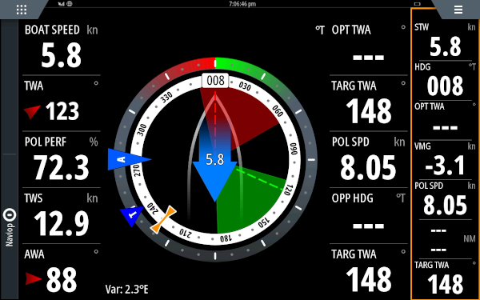

# Polar performance plugin
Generate performance information based on a polar diagram.

## MFD configuration

### B&G
To make use of the performance data and get e.g. lay lines you need to set:
 - Settings -> Chart -> Laylines -> Targets... -> True wind angle to 'Actual'
 
 - SailSteer screen -> Long press tile to add 'Performance -> Target TWA -> decollapse, choose SignalK'
 
Now the Target TWA is coming from SignalK and the laylines will be drawn based on it's value.

## Data correctness
It's assumed data is already corrected when it's read by this plugin. This can be sometimes be done by the sensor, sometimes upon entry into SignalK using the [calibration plugin](https://www.npmjs.com/package/@signalk/calibration).

## Data sources
The following paths are read
 - navigation.speedThroughWater
 - environment.wind.speedTrue
 - environment.wind.angleTrueWater
 - navigation.speedOverGround (optional)

## Plugin configuration
### Polar diagram
The polar diagram can be configured through CSV notation as used on [ORC sailboat data](https://jieter.github.io/orc-data/site/).

### Plugin options
In the plugin configuration you can toggle the following options:
 - Enable calculation of beat/upwind and run/gybe/downwind angle
 - Enable calculation of beat/upwind and run/gybe/downwind VMG
 - Enable calculation of Optimum Wind Angle (difference between TWA and beat/run angle (depends on beat/run angle)

## Calculated performance data
### Currently supported
 - Upwind / beat angle (performance.beatAngle) 
 - Downwind / run / gybe angle (performance.gybeAngle) 
 - Upwind / beat VMG (performance.beatAngleVelocityMadeGood) 
 - Downwind / run / gybe VMG (performance.gybeAngleVelocityMadeGood) 
 - Target TWA (performance.targetAngle) (equals upwind or downwind angle)
 - Optimal Wind Angle (diff between TWA and environment.wind.directionTrue)
 - Polar Boat Speed (performance.polarSpeed)
 - Polar Speed Ratio (performance.polarSpeedRatio)
 - Plugin option to use SOG as boat speed
 - Wind angle for maximum speed at this wind speed

### To-do list
 - Fill up the ends of the polar diagram
 - Improved interpolation
 - Make moment to do calculation smarter/configurable
 - Create polar from live data
 -- Save polar info to file
 -- Save new record speed for angle in polar
 -- Determine if we're on a steady course to avoid fake records
 -- Dampening algoritms
 -- Configure the resolution of the polar diagram
 - Support multiple polar diagrams
 - Capture heel in polar diagram
 - Visualisation of the polar diagram
